**LINE DETECTION USING HOUGH TRANSFORM**

**  **

## Abstract

This report presents a classical computer vision pipeline for detecting
and counting horizontal lines, called Hough Transform. The objective is
to estimate the number of ruling lines in synthetic document generated
images. The detection pipeline consists of several Open CV methods to
assist Hough Transform and determine the number of lines in a robust
manner.

The method is evaluated across three progressively challenging
scenarios: blank ruled paper, printed documents with overlaid text, and
noisy handwritten-style documents with jitter. To further analyze
robustness, a custom stochastic document generator was developed to
simulate realistic degradations including variable line spacing, angular
perturbations, intensity variations, breakages, texture noise, and
vignette blur.

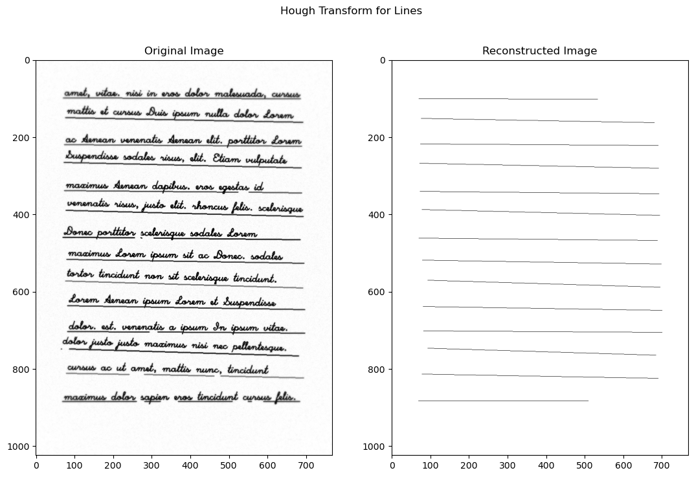

## Summary of Content

[Summary of Content [2](#abstract)](#abstract)

[1. Line Detection Approach
[3](#line-detection-approach)](#line-detection-approach)

[2. Hough Transform Parameter Choices
[4](#hough-transform-parameter-choices)](#hough-transform-parameter-choices)

[3. Results Across Four Scenarios
[5](#results-across-four-scenarios)](#results-across-four-scenarios)

[4. Comparison with a Foundation Model
[7](#comparison-with-a-foundation-model)](#comparison-with-a-foundation-model)

[5. Observed Failure Cases and Limitations
[8](#observed-failure-cases-and-limitations)](#observed-failure-cases-and-limitations)

[6. Conclusion [9](#conclusion)](#conclusion)

## 1. Line Detection Approach

The objective was to detect and count only horizontal lines in synthetic
document images generated deterministically from a roll number seed
instruction. The dataset includes three scenarios: blank ruled paper,
printed paper, and noisy handwritten paper. To further segment the
generalization of my algorithm, I created yet another paper generator
which will be discussed later.

My approach follows a classical computer vision pipeline:

### 1.1 Preprocessing

- **Grayscale Conversion  **
  The input image is converted to grayscale to simplify processing.

- **Gaussian Blurring  **
  A Gaussian filter (*K**e**r**n**e**l* = (7, 7)) is applied to reduce
  high-frequency texture noise introduced during paper generation.

- **Adaptive Thresholding  **
  Adaptive mean thresholding is used to binarize the image. This handles
  non-uniform illumination and vignette blur present in the generated
  data.

- **Morphological Opening (Horizontal Kernel)  **
  A horizontally elongated structuring element is used:

$$K\_{length} = \frac{I\_{width}}{f}$$

*K**h**e**i**g**h**t* = 3

*K* is the combing kernel,

*I* is the input image, and

*f* is a hyperparameter to control

> This suppresses non-horizontal structures while preserving long
> horizontal lines. This step is crucial in the printed and handwritten
> scenarios where text overlaps ruling lines.

### 1.2 Edge Detection

Canny edge detection is applied on the morphologically processed image:

*T**h**r**e**s**h**o**l**d**l**o**w* = *I**w**i**d**t**h* × *f**l**o**w*

*T**h**r**e**s**h**o**l**d**h**i**g**h* = *I**w**i**d**t**h* × *f**h**i**g**h*

*A**p**e**r**t**u**r**e**s**i**z**e* = 3

*T**h**r**e**s**h**o**l**d* is the combing kernel, TODO

*A**p**e**r**t**u**r**e* is the input image, and

*f* is a hyperparameter to control.

Scaling thresholds with image width ensures generalization across unseen
image sizes.

### 1.3 Hough Transform

I used the Probabilistic Hough Transform (cv2.HoughLinesP) because:

- It directly returns line segments.

- It allows control over minimum line length and gap tolerance.

- It is computationally efficient.

After detection:

- Line angle is computed.

- Only lines with angle within ±5° are retained.

- Nearby parallel detections (caused by thick lines or double edges) are
  merged.

This merging prevents over-counting.

## 2. Hough Transform Parameter Choices

The parameters were tuned to ensure robustness without hardcoding
assumptions.

### 2.1 Core Parameters

- **rho = 1  **
  Pixel resolution in Hough space. 1 works the best and is exhaustive
  (for horizontal lines).

- **theta = π / 180 / 20  **
  Fine angular resolution (~0.05°).  
  This allows detection of slightly tilted lines (hand-drawn case).  
  After several iterations through my custom generator, π / 180 was not
  enough, which forced me to decrement the step progressively until I
  reached a twentieth of a degree.

- **threshold = width × 0.104  **
  Minimum votes required by the edge pixels for a line in parameter
  space to be significant.  
  Scaled with image width for robustness.

- **minLineLength = width × 0.5  **
  Ensures only long ruling lines are detected (text fragments are
  ignored).  
  This is the most subjective parameter, noisy lines due to text cab be
  as small as 0.1\*width and as large as 0.6\*width of the paper. This
  can not be very easily resolved. Ideally (given the margins parameter)
  the lines are around 0.8\*width but this varies a lot. Moreover, due
  to broken lines this detection will ignore lines around 0.4\*width in
  length. Therefore I picked a middleman and implemented a separate
  merging algorithm to handle noise due to text lines.

- **maxLineGap = width × 0.104  **
  Helps reconnect broken lines caused by dropout and line break
  simulation.  
  Value determined based on random experiments.

### 2.2 Horizontal Filtering

Filtering away the lines based on how tilted they are compared to the
horizontal of the paper.

$$\theta = \tan^{- 1}\frac{y\_{2} - y\_{1}}{x\_{2} - x\_{1}}\\$$

*θ**t**o**l**e**r**a**n**c**e* = ±5∘

Tolerance value determined experimentally over several iterations in
sandbox. This value balances:

- Accepting slight angular jitter (hand-drawn case).

- Rejecting diagonal/vertical noise/margins/text-trends.

### 2.3 Line Merging

After Hough detection and horizontal line filtering, similar lines are
merged together:

- Lines are sorted by vertical position.

- Lines within *w**i**d**t**h* × 0.02 vertical distance are merged.

- Only the longer segment is retained.

This prevents counting two edges of the same thick line separately.
Experimentally, the ideal value was determined to be 0.016. However, we
have a decent margin above it, before which separate ruling lines would
be merged. I took full advantage of that, and experimented more to find
a merging threshold which will also merge lines identified due to text
trends. 0.02 is the sweet spot.

## 3. Results Across Four Scenarios

### 3.1 Blank Ruled Paper

Characteristics:

- Clean, evenly spaced horizontal lines.

- Minimal interference.

### 3.2 Printed Paper

Characteristics:

- At least 20 ruling lines (evenly spaced & uniform intensity).

- Overlaid printed text.

- Text strokes create horizontal and vertical edges.

### 3.3 Handwritten Paper

Characteristics:

- Noisy, jittered lines.

- Variable thickness.

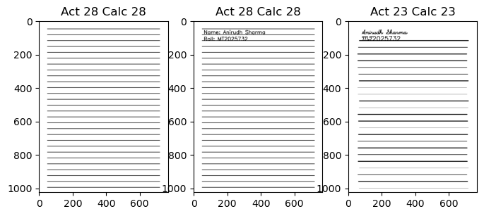

In either of the cases, the algorithm is performing nicely. These
scenarios validate correctness of the Hough configuration. Performance
depends strongly on min line length and merging tolerance.

### 3.4 Custom Generated Paper

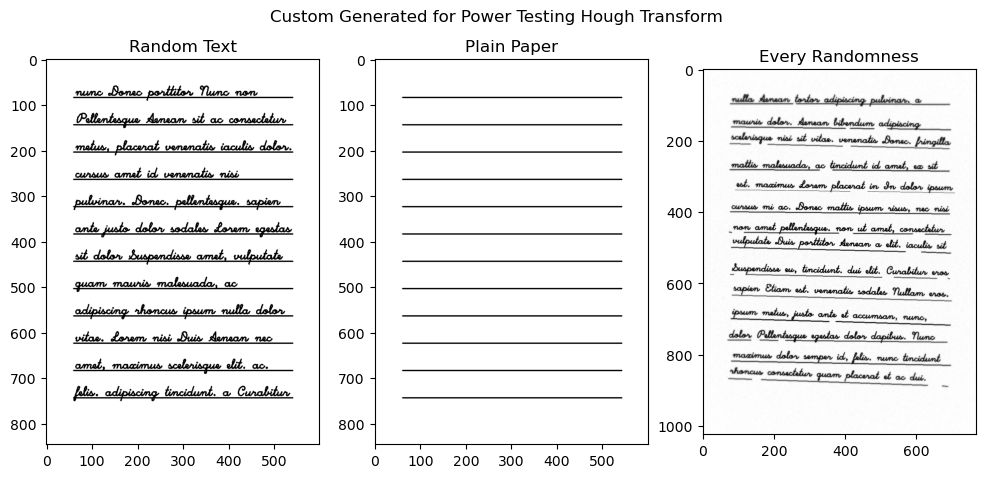

While the assignment provides three document generators (Blank Ruled,
Printed, Handwritten), I developed an additional, fully parameterized
synthetic document generator to systematically evaluate the robustness
of the Hough-based line detection pipeline (A Power Test).

Unlike the basic assignment generators, this system introduces
fine-grained stochastic control over geometric distortions, noise
characteristics, line irregularities, and degradation artifacts. The
goal was to simulate realistic scanning conditions and handwritten
variability to power-test the algorithm under extreme configurations;
and determine when it breaks.

The implementation is provided in generation\_utilities.py

The generator covers a whole package of destructive tools to ruin the
image making it harder to detect the lines at every step. Below is a
list of each such configuration or challenge parameters:

- Text The provided text or lorem ipsum is looped until it fills the
  page

- Margin Margins help control the space around the paper, making space
  for other

- Texture noise Add gaussian noise to paper surface, making peak
  counting difficult

- Line spacing Randomize the space between each line

- Line angle Randomize the angle the lines are drawn from the horizontal

- Line offset Randomize the shift along the horizontal about which the
  line is drawn

- Line thickness Randomize the thickness of each line

- Line intensity Randomize the color (darkness) of each line

- Line dropout Randomly skip drawing a few lines

- Line breaker Randomly break a few lines into two or more parts

- Vignette blur As a final touch, apply a radially increasing blur on
  the page

Image demonstrations will be provided in an Appendix at the end.

## 4. Comparison with a Foundation Model

### 4.1 Foundation Model Behavior

Prompt: "Count the number of lines in the given image." For each image

Results:

- On clean ruled paper – Perfect answers.

- On printed paper – Counted 1 extra line, probably confusion due to the
  text.

- On handwritten noisy paper – Somehow, got perfect answers.

- Custom generation success case – Counted 1 extra line

- Custom generation defeat case – Counted 1 extra line

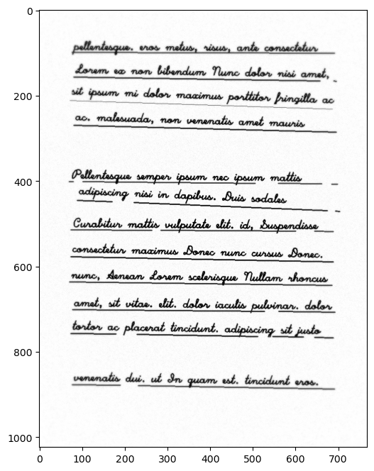

### 4.2 Inference

VLM models reason visually at a semantic level, while algorithmic models
are just deterministic to the state-space we tune them to. VLM view
image in general and usually don’t compare to the preciseness of
algorithms which run on every pixel. Like, VLMs can sometimes:

- Confuse text baselines with ruling lines

- Ignore faint or broken lines

- Overcount decorative or artifact edges

In contrast, the Hough pipeline is geometry-driven and more reliable for
structured detection tasks, given that we are able to properly set the
parameters.

## 5. Observed Failure Cases and Limitations

Even though performance is strong, several limitations exist:

### 5.1 Parameter Optimization Issue

If a line is heavily broken and the fragments are shorter than min line
length, it will not be detected.

If line tilt exceeds ±5°, the horizontal filter removes it.

Very thick lines can produce two parallel Hough detections, distant
enough to prevent merger.

The approach requires careful tuning of all the various parameters, and
debugging these issues can become a significant hassle. This is a task
only for those who understand the algorithm in depth.

### 5.2 Variable Scale Images

Most tests were conducted using images near the size of (768, 1024) with
similar aspect ratios. Text drawn on different scales have drastically
different local features relative to pixel size. This result in chaotic
noise which can not be dealt with easily. This problem does not happen
on large images, but then all parameters of the algorithms must be
adapted appropriately.

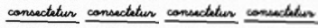

On the other hand, images with a different aspect ratio (like pages in
landscape), most mathematics become uncertain due to most of the
parameters being a scaled factor of width. For instance, text height is
a factor of line spacing, however mil line length is a factor of width.
This causes unexpected failures and new edge cases.

### 5.2 Unexpected Text Artifacts

Words like minimum has a lot of horizontal artifacts, which when
combined with the effect of “handwriting” style and “condensed” fonts
create false lines. These lines then are counted by Hough transform and
resulting in the algorithm deviating away from the actual answer.

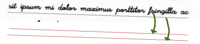

A lot of it can be dealt by manipulating the morphing factor and the mil
length parameter; however, this area has a significant overlap, which
means favoring one test case breaks other cases!

## 6. Conclusion

This work demonstrates the power of a classical computer vision,
horizontal line detection algorithm called the Hough Transform. In this
project we used several different functions provided by Open CV to
tackle the task of detecting horizontal lines given a page. The complete
pipeline goes like:

- Blurring away Noise

- Adaptive thresholding

- Morphological filtering

- Canny edge detection

- Probabilistic Hough Transform

- Horizontal Filtering

- Proximity Merging

The introduction of a custom document generator further enabled stress
testing under controlled degradations such as angular perturbations,
intensity variation, dropout, breakages, and spatially varying blur.
This revealed the sensitivity of line detection to parameters such as
minimum line length, angular tolerance, and gap allowance, while also
validating the robustness of the final configuration under moderate
distortions.

Although limitations emerge under extreme fragmentation, severe tilt, or
very faint line intensity, the pipeline generalizes effectively without
relying on hardcoded assumptions. On the given test cases, plain paper,
printed paper and the handwritten paper, the algorithm successfully
estimated the correct count. However, in the power test generations, the
algorithm only acquired 43% exactly match accuracy in 1000 test runs. If
an error margin of 1 line more or less is allowed, the accuracy spiked
up to 82%.

A plot of deviations from the actual answer.

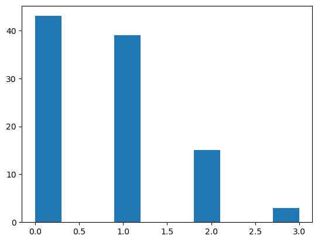

### Appendix: Custom Line Generator

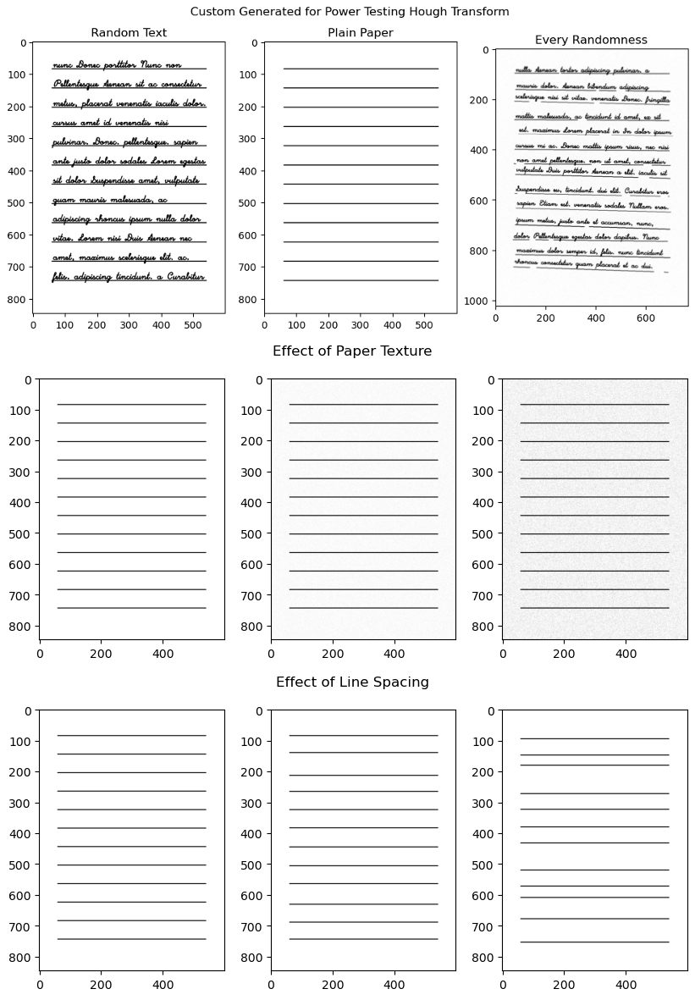

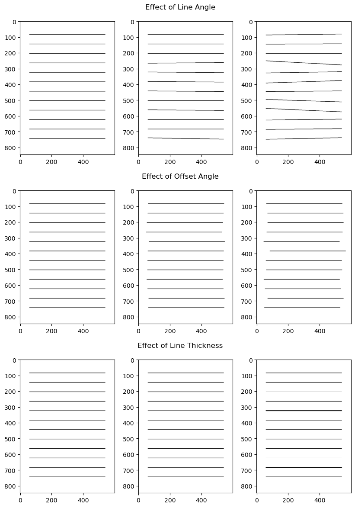

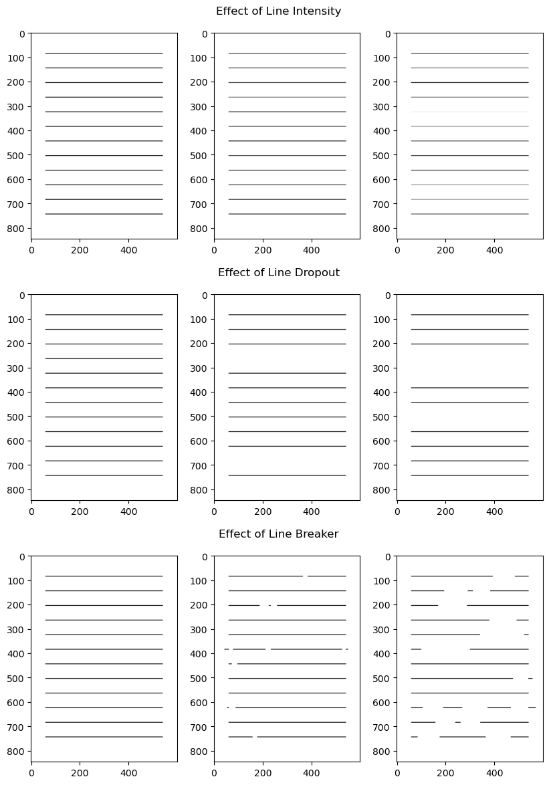

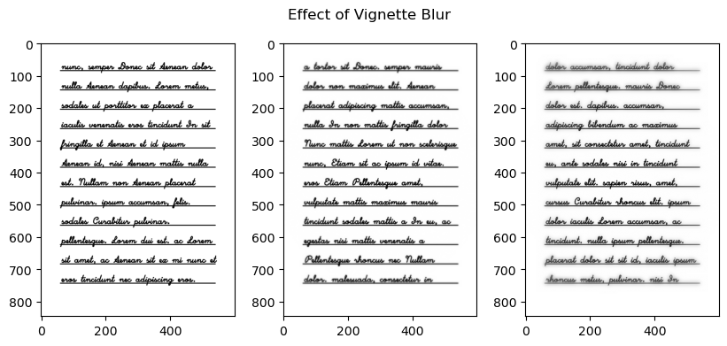

Appendix: Detect Lines Algorithm

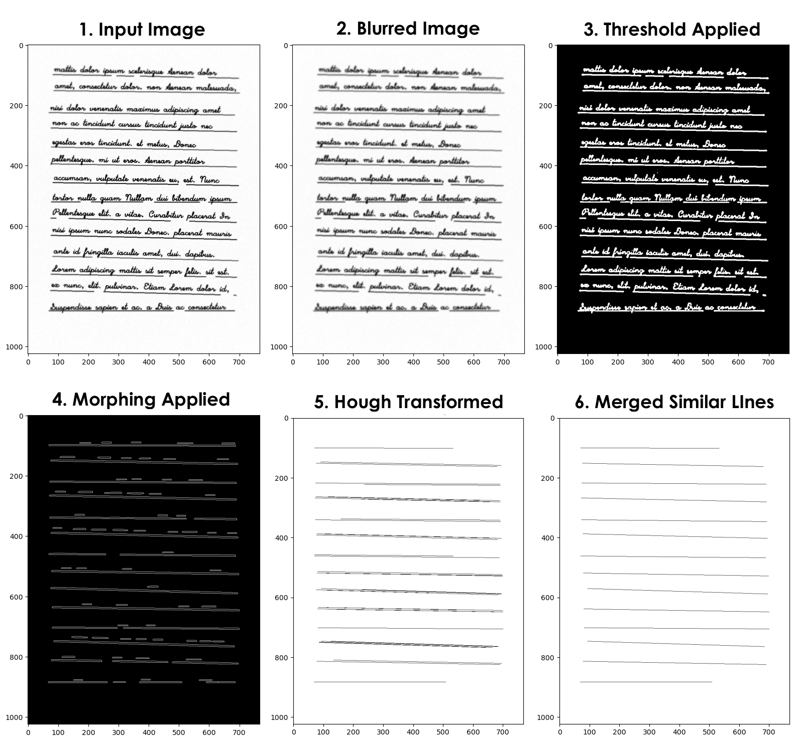
